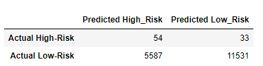
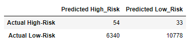

# Credit Risk Analysis

## Overview
Our purpose is to use various machine learning methods to predict individual credit risk. This analysis will help us determine which of our methods provides the greatest accuract and perhaps which factors are most important in determining an individual's credit risk.

## Results
Below are shown two examples of confusion matrices from our analysis. The first is from the Naive Random Sampling method and the second from SMOTE Oversampling. It is interesting that both of these methods correctly predicted 54 of the actually high risk individuals. However, the SMOTE method mistakenly assigned around 800 more individuals to high risk which were actually low risk than the Naive method did. Unsurprisingly, Naive had an accuracy score of 67% and SMOTE only 63%. Between the two it seems that Naive is better for this example.

## Summary
There are many methods to explore machine learning. And the holidays are a difficult time to explore all of them, but our analysis can at least show that Naive was better for our purposes.
